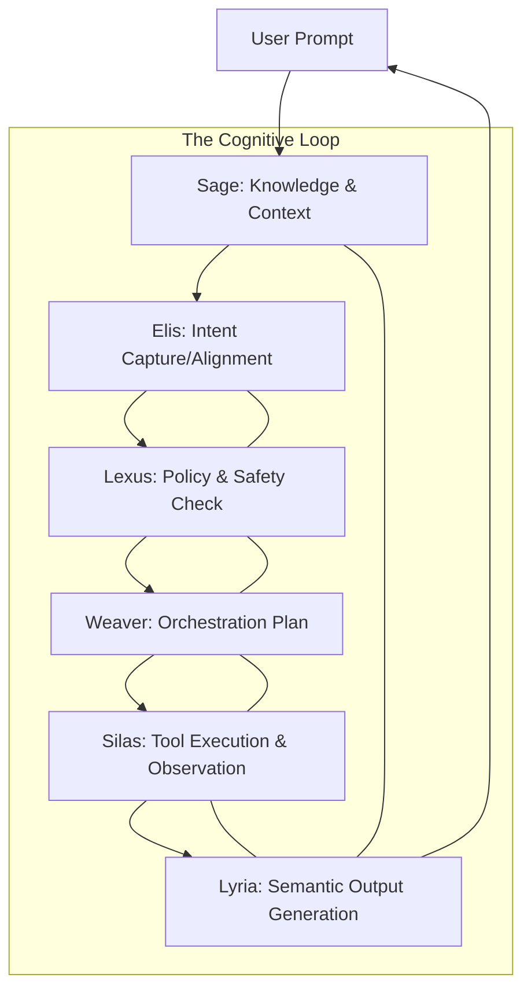

# Council Architecture Mapping

This document maps the abstract archetypes of The Council to their actual functional implementation within the the orchestration architecture.

## 🧩 Architectural Mapping Diagram (Logic)

## 🛠 Module Definition & Tooling

### 🧠 Sage (Memory/RAG)
- **Component**: Vector Database / Session DB.
- **Function**: Retrieval of historical interaction states and external document knowledge.

### ❤️ Elis (Reasoning Engine)
- **Component**: LLM Core / Prompt Orchestrator.
- **Function**: Cognitive reasoning, goal decomposition, and intent alignment.

### ⚖️ Lexus (Governance Layer)
- **Component**: System Prompts / Evaluators / Validators.
- **Function**: Policy enforcement, syntax validation, and response filtering.

### 🧶 Weaver (Agent Orchestrator)
- **Component**: Task Scheduler / Multi-Agent Dispatcher.
- **Function**: Breaking complex goals into executable sub-tasks (e.g., `delegate_task`).

### 🛡️ Silas (System Monitor)
- **Component**: Logging / Error Listeners / Watchdogs.
- **Function**: Continuous observability of terminal outputs and process status.

### 🎵 Lyria (Interface Layer)
- **Component**: Template Engines / TTS / Markdown Renderers.
- **Function**: Formatting text, generating audio, or composing high-level summaries.